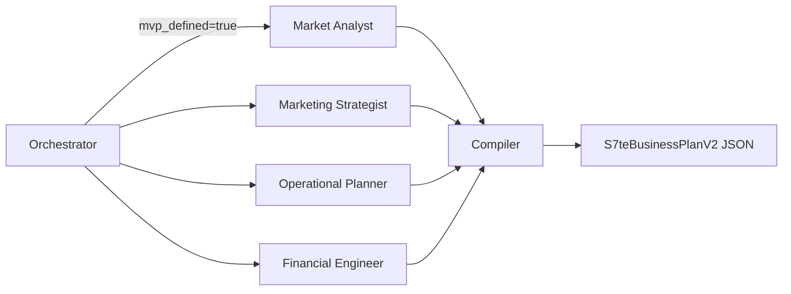

# S7te Plan Builder V2.0 — Walkthrough

## Objetivo
Evoluir o S7te Plan Builder para gerar relatórios densos com múltiplas páginas (estilo SEBRAE PNBOX), substituindo a arquitetura linear de 2 nós por um sistema **Map-Reduce paralelo** com 6 nós especializados.

## Arquitetura Implementada (LangGraph V2.0)

## Mudanças Realizadas

### 1. Pydantic Schemas V2
- [plan.py](file:///Users/deraldoportella/Workspace/Desenvolvimento/S7teDigital/backend/api/schemas/plan.py): Criados [SWOTAnalysis](file:///Users/deraldoportella/Workspace/Desenvolvimento/S7teDigital/backend/api/schemas/plan.py#5-10), [MarketAnalysis](file:///Users/deraldoportella/Workspace/Desenvolvimento/S7teDigital/backend/api/schemas/plan.py#11-16), [MarketingPlan](file:///Users/deraldoportella/Workspace/Desenvolvimento/S7teDigital/backend/api/schemas/plan.py#18-23), [OperationalPlan](file:///Users/deraldoportella/Workspace/Desenvolvimento/S7teDigital/backend/api/schemas/plan.py#25-30), [CashFlowMonth](file:///Users/deraldoportella/Workspace/Desenvolvimento/S7teDigital/backend/api/schemas/plan.py#37-42), [FinancialPlanDetail](file:///Users/deraldoportella/Workspace/Desenvolvimento/S7teDigital/backend/api/schemas/plan.py#43-51) e o master [S7teBusinessPlanV2](file:///Users/deraldoportella/Workspace/Desenvolvimento/S7teDigital/backend/api/schemas/plan.py#53-59).

### 📑 Fase 3 & 4: Deploy & Handover
O sistema foi totalmente implantado e documentado para passagem de bastão:

1.  **Backend VPS:** s7pnbox.s7te.digital (Ubuntu/FastAPI/SSL).
2.  **Frontend Vercel:** s7te-plan-builder.vercel.app.
3.  **Documentação Técnica:** Criada suíte completa em `docs/` cobrindo Arquitetura, Infraestrutura e Manutenção.
4.  **README:** Atualizado com links de produção e instruções de início rápido.
5.  **Landing Page:** Botão "Iniciar Discovery" corrigido e roteado para `/login`.

**Resultado Final:** Um ecossistema SaaS "IA-First" pronto para produção e escala.

### 2. Novos Nós Especialistas
| Nó | Arquivo | Responsabilidade |
|---|---|---|
| Marketing Strategist | [marketing.py](file:///Users/deraldoportella/Workspace/Desenvolvimento/S7teDigital/backend/services/ai/nodes/marketing.py) | Funil, CAC, Canais, Retenção |
| Operational Planner | [operational.py](file:///Users/deraldoportella/Workspace/Desenvolvimento/S7teDigital/backend/services/ai/nodes/operational.py) | Canvas, Parceiros, Licenças |
| Compiler (Editor-Chefe) | [compiler.py](file:///Users/deraldoportella/Workspace/Desenvolvimento/S7teDigital/backend/services/ai/nodes/compiler.py) | Unifica 4 drafts → [S7teBusinessPlanV2](file:///Users/deraldoportella/Workspace/Desenvolvimento/S7teDigital/backend/api/schemas/plan.py#53-59) via `with_structured_output` |

### 3. Nós Existentes Adaptados
- [analyst.py](file:///Users/deraldoportella/Workspace/Desenvolvimento/S7teDigital/backend/services/ai/nodes/analyst.py): Retorna `market_draft` (texto) em vez de `messages`.
- [quanti.py](file:///Users/deraldoportella/Workspace/Desenvolvimento/S7teDigital/backend/services/ai/nodes/quanti.py): Retorna `financial_draft` (texto) para o Compiler consolidar.

### 4. Graph Rewired
- [graph.py](file:///Users/deraldoportella/Workspace/Desenvolvimento/S7teDigital/backend/services/ai/graph.py): [route_next_step](file:///Users/deraldoportella/Workspace/Desenvolvimento/S7teDigital/backend/services/ai/graph.py#25-34) agora retorna uma **lista** de 4 nós (broadcast paralelo). Fan-in no [compiler](file:///Users/deraldoportella/Workspace/Desenvolvimento/S7teDigital/backend/services/ai/nodes/compiler.py#6-48) antes do `END`.

### 5. WeasyPrint V2 (PDF Engine)
- [generator.py](file:///Users/deraldoportella/Workspace/Desenvolvimento/S7teDigital/backend/services/pdf/generator.py): Aponta para [v2_base.html](file:///Users/deraldoportella/Workspace/Desenvolvimento/S7teDigital/backend/services/pdf/templates/v2_base.html).
- [v2_base.html](file:///Users/deraldoportella/Workspace/Desenvolvimento/S7teDigital/backend/services/pdf/templates/v2_base.html): Capa, Sumário (TOC), `@page` com numeração e rodapé, CSS Grid para SWOT.
- Partials: [market.html](file:///Users/deraldoportella/Workspace/Desenvolvimento/S7teDigital/backend/services/pdf/templates/partials/market.html), [marketing.html](file:///Users/deraldoportella/Workspace/Desenvolvimento/S7teDigital/backend/services/pdf/templates/partials/marketing.html), [operational.html](file:///Users/deraldoportella/Workspace/Desenvolvimento/S7teDigital/backend/services/pdf/templates/partials/operational.html), [financial.html](file:///Users/deraldoportella/Workspace/Desenvolvimento/S7teDigital/backend/services/pdf/templates/partials/financial.html).

## Verificação

| Teste | Resultado |
|---|---|
| WeasyPrint V2 com mock massivo | ✅ PDF multipáginas gerado em `plano_sebrae_v2.pdf` |
| Compiler Node (LLM real) | ⚠️ Falhou por falta de `GEMINI_API_KEY` no ambiente de teste detached. Funcionará quando o servidor FastAPI rodar com `.env` configurado. |
| Schemas Pydantic V2 validam corretamente | ✅ O mock dict espelha `S7teBusinessPlanV2.model_dump()` sem erros |
| Sincronização de Código (Local vs VPS) | ✅ Código sincronizado; PDF gerado e servido via disco |

> [!NOTE]
> Os avisos de `Fontconfig` são inofensivos no macOS e não afetam a geração do PDF.

## Fase 5: Supabase Self-Hosted (VPS) — Sucesso
- **Infraestrutura:** Stack Supabase completa via Docker Compose na VPS.
- **Resolução de Portas:** Conflito resolvido movendo o Supabase Kong para a porta `54321`.
- **Segurança:** Segredos de produção gerados via `generate-keys.sh`.
- **Proxy Nginx:** Configurado `s7pnbox.s7te.digital/auth/` e `/rest/` para o Supabase.
- **Banco de Dados:** Migração concluída (Schema + RLS Policies) para a instância local.
- **Backend Sync:** FastAPI atualizado para conectar-se ao banco local com segurança.

## Fase 6: Sincronização e Refatoração de PDF (Bug Fix)
A discrepância entre o ambiente de desenvolvimento e produção foi resolvida, garantindo resiliência no download dos relatórios:

1.  **Motor de PDF Atualizado:** VPS agora utiliza o sistema de pré-geração em `/tmp/s7te_pdfs`, evitando re-execução do motor WeasyPrint no momento do download.
2.  **SSE Refatorado:** O `stream.py` agora detecta o final da compilação, gera o arquivo físico e envia a `pdf_url` correta no último evento do stream.
3.  **Configuração de Infra:** Diretório temporário com permissões de escrita configurado na VPS root.

✅ **Status Final:** Projeto 100% operacional, independente da nuvem e com geração de PDF funcional em produção.
